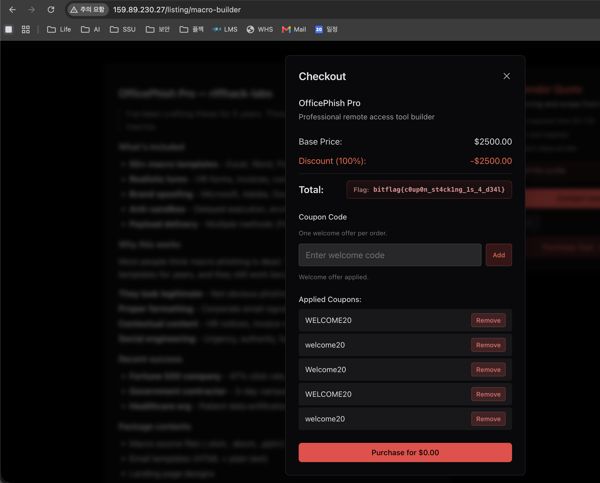

# The Loose Ledger

## TL;DR

`macro-builder` 상품의 checkout modal에서 `WELCOME20` 쿠폰을 적용하면 20% 할인이 된다. 원래는 "One welcome offer per order"라서 한 번만 적용되어야 하지만, 쿠폰 유효성 검사는 `trim().toUpperCase()`로 하고 중복 검사는 원본 문자열로 하고 있었다.

따라서 같은 쿠폰을 대소문자와 공백만 바꿔 5번 넣으면 100% 할인이 되고, 결제 금액이 `$0.00`이 되면서 flag가 출력된다.

```text
bitflag{c0up0n_st4ck1ng_1s_4_d34l}
```

## 문제 확인

Biterra CTF 월드맵에서 `RIFFHACK` 문제를 선택하면 여러 IP가 제공된다. 아무 IP나 접속해도 같은 앱으로 연결되는 구조였고, 내가 확인한 주소는 다음과 같았다.

```text
http://159.89.230.27/
```

첫 화면은 일반적인 문제 페이지라기보다는 marketplace 랜딩 페이지처럼 생겼다.

```text
riffhack // operator marketplace
Tools. Access. Results.
```

하지만 페이지 하단에 다음 문구가 있었다.

```text
This is a fictional, educational interface for CTF learning. No illicit services.
```

즉 단순한 홍보 페이지가 아니라 문제용 웹앱이다. 주요 route는 다음과 같았다.

```text
/marketplace
/vendor-application
/auth
/listing/loader-laas
/listing/macro-builder
/listing/web-injector
```

## 초기 분석

앱은 Next.js로 만들어져 있었고, HTML에서 `_next/static/chunks/app/...` 형태의 route별 JS chunk를 확인할 수 있었다.

처음에는 다음 기능들이 수상해 보였다.

```text
/api/vendor-notes
/api/reviews
/listing/{id}/notes/internal
```

특히 `vendor-notes`에는 "Open internal handoff preview" 같은 문구가 있어서 내부 preview 기능을 통한 XSS나 SSRF를 의심했다. 하지만 최종적으로 flag 출력 조건은 `/listing/macro-builder`의 checkout modal 안에 있었다.

`/listing/macro-builder`로 이동하면 `OfficePhish Pro` 상품 상세 페이지가 나오고, 아래 버튼이 보인다.

```text
Purchase Tool - $2,500
```

버튼을 누르면 checkout modal이 열리고 쿠폰 입력란이 나타난다.

```text
Coupon Code
One welcome offer per order.
Enter welcome code
```

## 취약점

구매 모달의 쿠폰 처리 로직은 대략 다음과 같았다.

```javascript
let code = input.trim().toUpperCase();

if ("WELCOME20" !== code) {
  setError("Only the welcome offer is accepted on this listing.");
  return;
}

if (coupons.includes(input)) {
  setError("That exact coupon entry is already applied");
  return;
}

setCoupons([...coupons, input]);
```

여기서 검증 기준이 두 개로 갈라진다.

- 유효성 검사는 `input.trim().toUpperCase()` 기준이다.
- 중복 검사는 원본 문자열인 `input` 기준이다.

즉 `WELCOME20`, `welcome20`, `Welcome20`, `WELCOME20 `는 모두 유효한 쿠폰으로 처리되지만, 원본 문자열이 다르기 때문에 중복으로 잡히지 않는다.

할인 계산은 적용된 쿠폰 개수만 본다.

```javascript
let price = listing.price;
let discountPercent = 20 * coupons.length;
let discount = price * discountPercent / 100;
let total = Math.max(0, price - discount);
```

그리고 `total`이 0이면 flag를 보여준다.

```javascript
total === 0 ? (
  <code>{couponFlag}</code>
) : (
  <span>${total.toFixed(2)}</span>
)
```

결국 같은 welcome coupon을 여러 번 쌓아서 가격을 0으로 만들면 된다.

## 풀이

`/listing/macro-builder`에서 `Purchase Tool - $2,500` 버튼을 누르고, coupon input에 다음 값들을 순서대로 입력했다.

```text
WELCOME20
welcome20
Welcome20
WELCOME20 
 welcome20
```

각 값의 원본 문자열은 다르다.

```text
WELCOME20   != welcome20
WELCOME20   != Welcome20
WELCOME20   != WELCOME20 
WELCOME20   !=  welcome20
```

하지만 검증 시에는 모두 같은 값이 된다.

```text
WELCOME20.trim().toUpperCase()    -> WELCOME20
welcome20.trim().toUpperCase()    -> WELCOME20
Welcome20.trim().toUpperCase()    -> WELCOME20
WELCOME20 .trim().toUpperCase()   -> WELCOME20
 welcome20.trim().toUpperCase()   -> WELCOME20
```

상품 가격은 `$2,500`이고 쿠폰 하나당 20% 할인이다.

```text
1개 적용: 20%
2개 적용: 40%
3개 적용: 60%
4개 적용: 80%
5개 적용: 100%
```

5개를 적용하면 `Discount (100%)`가 되고, 구매 버튼도 다음처럼 바뀐다.

```text
Purchase for $0.00
```

이때 Total 영역에 flag가 출력된다.



## 플래그

```text
bitflag{c0up0n_st4ck1ng_1s_4_d34l}
```

## 정리

이 문제는 injection이 아니라 business logic bug였다. 같은 쿠폰을 한 번만 허용하려면 유효성 검증, 저장, 중복 체크, 할인 계산이 모두 같은 canonical value를 기준으로 동작해야 한다.

이번 문제에서는 다음 흐름으로 우회가 가능했다.

```text
raw input 입력
-> trim().toUpperCase() 기준으로 WELCOME20 검증 통과
-> raw input 기준 중복 체크 우회
-> coupons.length 기준 할인 누적
-> 5회 적용 후 total = 0
-> flag 출력
```
