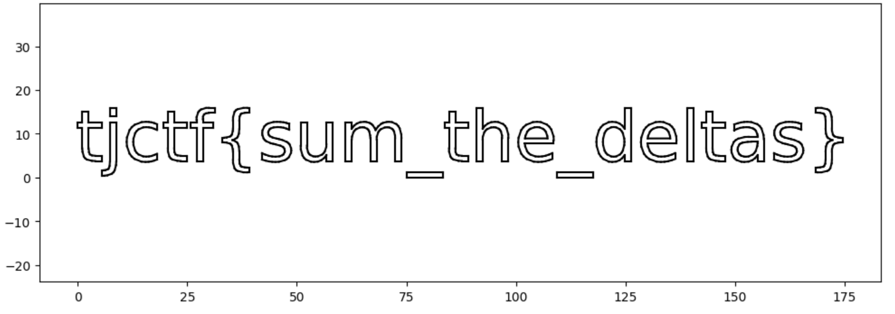

# delta-doodle

## 문제 설명

> i was calibrating the new AR airbrush for our maker faire booth by doodling the flag in midair. the headset, unfortunately, only logged the raw data. can you accumulate the motion trail and figure out what message we were trying to spray-paint?

- 첨부파일 : 'trackpad_deltas.csv'

## 풀이

### 분석

문제 설명에서 핵심 키워드는 다음과 같다.

- `raw data`
- `accumulate`
- `motion trail`
- `doodling`

특히 `accumulate` 라는 표현 때문에 이동 데이터를 누적하여 실제 궤적을 복원하는 문제임을 유추할 수 있다.

첨부된 CSV 파일을 확인해보면 다음과 같은 컬럼이 존재한다.

```text
time_ms, dx, dy, pen_down
```

여기서 중요한 점은 좌표가 `x`, `y` 가 아니라 `dx`, `dy` 라는 것이다.

즉, '절대좌표'가 아니라 '이전 위치로부터 얼마나 이동했는지'를 의미하는 delta 값이다.

따라서 실제 위치는 다음과 같이 누적합으로 계산할 수 있다.

```python
x += dx
y += dy
```

또한 `pen_down` 값은 실제로 선을 그리는 상태인지 여부를 나타낸다.

- `1` → 그리는 중
- `0` → 이동만 하는 중

따라서 `pen_down == 1` 일 때만 선을 이어서 그리면 된다.

### 취약점

이 문제는 전형적인 취약점 문제라기보다는 데이터 복원 및 시각화 문제에 가깝다.

주어진 raw motion data(delta 값)를 누적하여 원래의 드로잉 데이터를 복원함으로써 flag를 획득할 수 있다.

### 익스플로잇

우선 CSV 데이터를 읽고 좌표를 누적한다. 이후 `pen_down == 1` 상태인 구간만 이어서 plot 한다.

```python
import pandas as pd
import matplotlib.pyplot as plt

df = pd.read_csv("trackpad_deltas.csv")

x, y = 0, 0
xs, ys = [], []

for _, row in df.iterrows():
    x += row["dx"]
    y += row["dy"]

    xs.append(x)
    ys.append(y)

plt.figure(figsize=(12,4))

for i in range(1, len(df)):
    if df["pen_down"][i]:
        plt.plot(
            [xs[i-1], xs[i]],
            [ys[i-1], ys[i]],
            color="black"
        )
plt.axis("equal")
plt.show()
```

실행 결과 글자가 나타나며 플래그를 확인할 수 있다.




## 플래그

```
tjctf{sum_the_deltas}
```

## 배운 점

- delta 데이터는 누적합으로 원본 데이터를 복원할 수 있다.
- 센서/트래킹 데이터는 시각화하면 의미 있는 정보가 드러나는 경우가 많다.
- `matplotlib` 를 이용한 간단한 plotting 만으로도 숨겨진 정보를 복원할 수 있다.